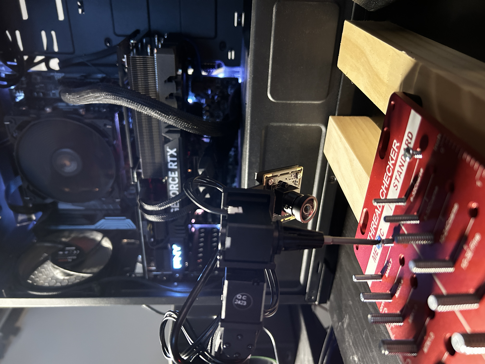
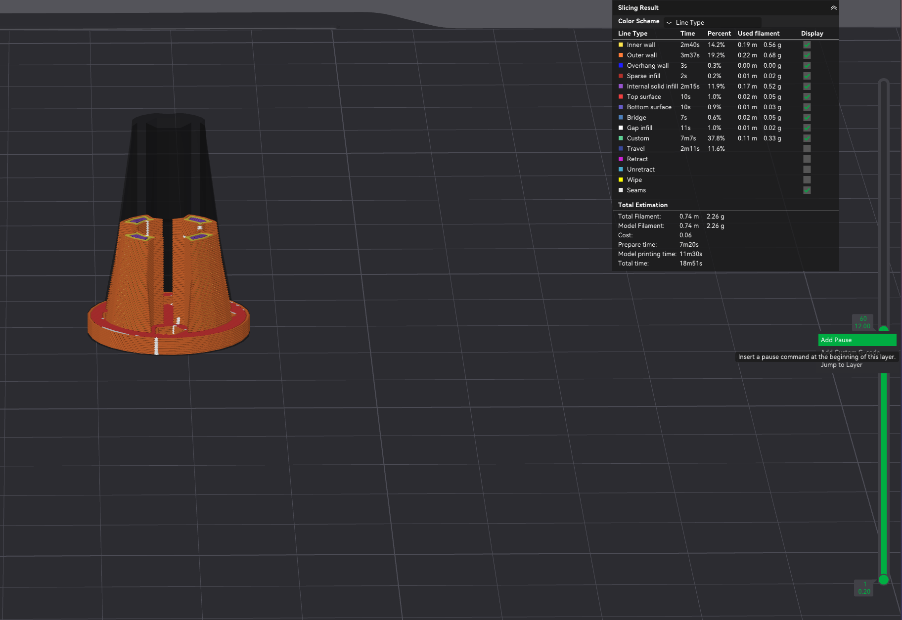

# Koch Robotic Arm Screwdriver

A screwdriver attachment and camera mount for the Koch robotic arm.

## Video Demo
[Watch the demo on YouTube](https://www.youtube.com/shorts/0c0qmF34xng)

## Bill of Materials
* SVPRO 5MP 30FPS USB Camera 
    * $53.99 on [Amazon](https://www.amazon.com/dp/B0D8SS2KNZ?ref_=ppx_hzod_image_dt_b_fed_asin_title_0_0&th=1)
* 6 mm diameter × 2 mm height neodymium magnets — 5 pcs  
    * $5.99 for 50 on [Amazon](https://www.amazon.com/dp/B079FLRQJP?ref=ppx_yo2ov_dt_b_fed_asin_title&th=1)*

## Instructions
1. Position both parts on the print bed:  
   • `stl/screwdriver_servo_holder_with_camera_mount_v1.2.stl`  
   • `stl/koch_screwdriver_chuck.stl`
2. In your slicer (e.g. Bamboo Studio for the X1-Carbon) add a pause at the top of the magnet cavity.  
   See this tutorial: https://www.youtube.com/watch?v=SBewgnA0Z2s
3. When the print pauses, insert a stack of 5 magnets into the cavity.
4. Resume printing.
